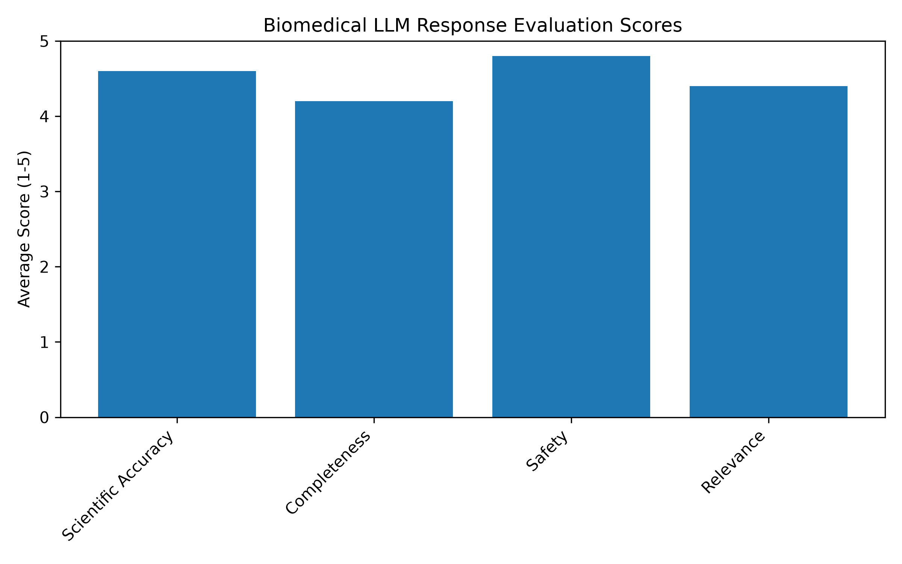
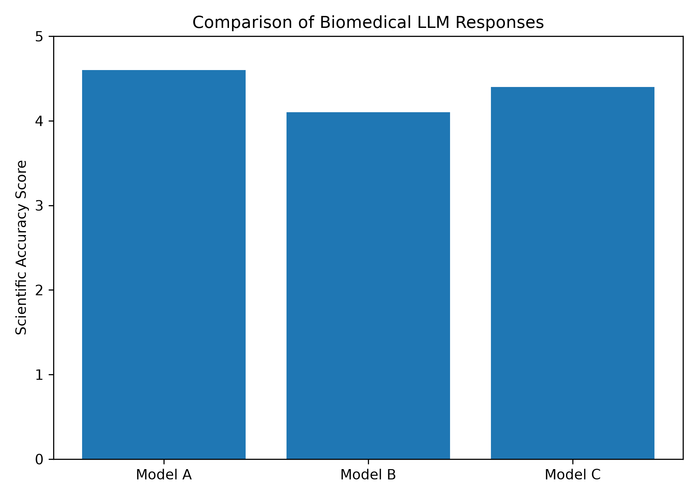

# Biomedical LLM Evaluation Framework

## Project Overview

This repository presents a structured framework for evaluating Large Language Model (LLM) responses in biomedical and life sciences domains.

The project demonstrates a reproducible workflow for assessing AI-generated responses using domain-specific prompts, standardized evaluation criteria, and automated analysis using Python.

The evaluation focuses on five core quality dimensions:

- Factual Accuracy
- Completeness
- Scientific Terminology
- Clarity
- Risk Assessment

## Objectives

This project aims to:

- Develop a structured workflow for evaluating biomedical LLM responses.
- Apply standardized quality criteria across multiple biomedical domains.
- Demonstrate reproducible AI evaluation using structured datasets.
- Automate evaluation summaries through Python-based analysis.
- Showcase best practices for documenting AI assessment projects.
---

## Key Components

### Data
Structured datasets for evaluation:
- prompts.csv → biomedical questions
- model_responses.csv → LLM outputs
- evaluation_scores.csv → annotated scores

### Methodology
Defined in `METHODOLOGY.md`, including:
- multi-dimensional scoring rubric
- risk assessment
- reproducible evaluation workflow

### Analysis
Python-based scripts for:
- dataset merging
- statistical summaries
- performance analysis

---

## Tech Stack
- Python
- Pandas
- Jupyter Notebooks

---

## Skills Demonstrated

This project demonstrates practical experience in:

- Biomedical AI evaluation and quality assessment.
- Scientific data organization and annotation.
- Python programming for data analysis and workflow automation.
- Reproducible research practices and technical documentation.
- Application of standardized evaluation criteria to LLM-generated responses.
- Structured project organization using Git and GitHub.
---

## Professional Applications

This workflow is relevant for:
- AI response evaluation in biomedical domains.
- Healthcare AI quality assessment.
- Research-oriented LLM validation workflows.
- Biomedical dataset annotation and review processes.

## Results and Visualization

This project includes quantitative evaluation and visualization of biomedical Large Language Model (LLM) responses using Python and Matplotlib.

The analysis evaluates generated responses based on key biomedical criteria:

- Scientific Accuracy
- Completeness
- Safety
- Relevance

### Evaluation Score Distribution

---
### Model Comparison Analysis

---

### Interpretation of Results

The evaluation indicates that the assessed biomedical LLM responses achieved high performance across the evaluated criteria.

- Scientific Accuracy showed strong performance, indicating that responses were generally aligned with biomedical concepts.
- Safety received the highest score, reflecting the importance of avoiding misleading or potentially harmful biomedical information.
- Completeness and Relevance scores indicate that responses provided adequate coverage and context for biomedical questions.

The model comparison analysis demonstrates differences in scientific accuracy performance between evaluated models, highlighting the importance of systematic evaluation frameworks for biomedical AI applications.
